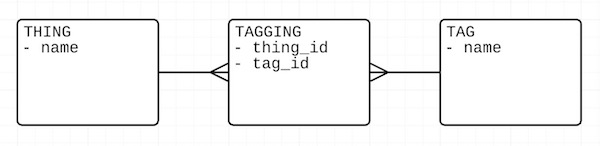

# Sinatra Walkthrough

## What is Sinatra?

Sinatra is the no-frills version of Rails. Whereas Rails comes out-of-the-box with an abundance of shortcuts and tools, Sinatra comes with very few.

> Why might this be an advantage?

There are many similarities between Sinatra and Rails, especially in terms of syntax.

Here are some real-life Sinatra apps:
- [Sinatra in the Wild](http://www.sinatrarb.com/wild.html)
- [Magnetic HTML](https://github.com/RobertAKARobin/play.magnetichtml.com)

## Framing

> Note: Assumes students have had exposure to MVC first.

We're going to create an app called Thingatra. It's a little app that lets you tag anything: to tag "apple" as "fruit" and "delicious", and "koala" as "cute", "fuzzy", and "Australian", for example.

Here's the ERD:



Note that this is a "many-to-many" relationship -- not because that has anything to do with Sinatra, but because it'll give us a bit more practice with them.

# Getting Started

## Download this repo

Checkout the `code` branch.

Each step below has a corresponding commit. You can see them here:

https://github.com/ga-wdi-lessons/sinatra-walkthrough/commits/code

## Load the appropriate gems

You'll need four:
- `sqlite3`
- `activerecord`
- `sinatra`
- `sinatra-contrib`

> Think back: How do you load Gems?

Note: We're using SQLite3 here. To do this with PostgreSQL it would be the exact same process, only you would use the `pg` Gem instead of the `sqlite3` Gem.

## Create a server file

For example, `app.rb`. The filename doesn't matter, but convention is `app.rb`.

At the top, require `sinatra` and `sinatra/reloader`. This second Gem will make automatically Sinatra restart every time you "save" your text editor.

> Think back: How do you require Gems?

Then:

```rb
get "/" do
  "Welcome to Thingatra!"
end
```

> What is `get`?

> What is `/`?

## Create a `config.ru` Rack file

Rack is the server that underlies most Ruby apps.

Create a file called `config.ru` and put these two lines of code in it:

```rb
require_relative "app"
run Sinatra::Application
```

That's all you need!

## Start your server

Simply type:

```sh
$ rackup
```

> That's where the `.ru` in `config.ru` gets its name.

You should see this line:

```sh
[2016-03-22 20:04:23] INFO  WEBrick::HTTPServer#start: pid=30546 port=9292
```

You can now view your app in your browser.

> Rails apps use port 3000. To view a Rails app, you go to `localhost:3000` in your browser. Where would you go for Sinatra?

## Connect to the database

> Think back: How did you do this when you first learned ActiveRecord?

In this case we're going to use a SQLite3 database. Sinatra works just fine with PostgreSQL; this will just give you some exposure to a different kind of widely-used database. The tradeoff is you won't be able to deploy this to Heroku.

The connection process is the same as it is for PostgreSQL, but your "adapter" will be `sqlite3`.

SQLite3 saves all your data in a single file *in the same directory as your app*. I **strongly** recommend creating a `.gitignore` file with the name of your database in it so that you don't accidentally push your database to Github.

There's nothing to run in this step -- just create the file.

## Create your schema

You can do this in SQL, but why bother when ActiveRecord works just fine?

```rb
ActiveRecord::Schema.define do
  create_table :tags, force: :cascade do |t|
    t.string  :name
  end
end
```

> What file(s) do you need to "require" in your schema file?

You should have one `create_table` in there for each table. This shows just the `tags` table. Refer back to the ERD for the other tables.

> Rails defines schema the exact same way in `db/schema.rb` -- but it does it automatically.

> Note the `force: :cascade`. This means whenever the schema file is run, it will destroy and rebuild that particular table.

Now, run the schema file the way you'd run any Ruby file. **There are no `rake` commands here!**

When you do this, you should see a new file pop up with the name of your database. You won't be able to read it -- it's in binary.

## Define your models

This is the exact same format as with Rails. For simplicity's sake, I recommend putting all the models in one file. (If you were building a bigger app you'd probably want them in separate files.)

Refer to the ERD to determine which relationships you should define.

## Create seed data

This is the exact same format as with Rails. Feel free to make your own tags!

## Display all the tags on the one route you've defined so far

> Hint: If all you see is something like `###` in your browser, try checking the source code -- or try using the `.to_json` method.

## Add an application layout and an "index" view

By default, Sinatra looks for all its views in a `views` folder.

These files should end with the name `.erb` (rather than `.html.erb` as in Rails).

You tell Sinatra which layout you want to use (one is usually enough), and which view you want to insert into it, like this:

```rb
erb :my_view, layout: :my_layout
```

Aside from that, they work the exact same way.

> Think back: What one line of ERB code must you have in a layout in order for it to be able to include other views?

## Create a "show" page for tags

In Rails and Sinatra, routes work like this:

| If you go to localhost:1234/... | it matches this route | and `params[:id]` equals | `params[:tag_id]` |
|:--- |:--- |:--- |
| `/tags/32` | `/tags/:id` | 32 | nil |
| `/tags/32/items` | `/tags/:tag_id/items` | nil | 32 |
| `/tags/32/items/19` | `/tags/:tag_id/items/:id` | 19 | 32 |

So if you define a route with `get "/tags/:id" do`, inside it you will have access to `params[:id]`.

You don't *have* to put an ID in the URL. It can be anything you want, as long as it doesn't contain spaces or punctuation besides `-` and `_`. Why not use the tag's name?

Have the show page display all the "things" that share that tag.

## Add links to each tag

Do this on the index page.

You don't get `link_to` anymore -- you'll need to write some actual HTML (with ERB included).

## Add a form so that you can create a new tag

Do this on the index page.

You don't get `form_for` here -- you'll need to write HTML.

> Think back: Which HTTP method do we associate with creating new data?

> Look at how `form_for` shows up in your browser. Copy the pattern used there for `input` elements.

## Create a route to receive the data from this form

> If GET routes are made using `get "/something" do`, how would you write a route for that HTTP method?

> `puts params` may be helpful.

## Add in some CSS

By default, Sinatra looks for "static assets" (stylesheets, images, and javascript) in a folder called `public`. Don't include `public` when linking to these files, but *do* begin the link with a slash `/`.

# Next steps

- Create a form for adding a Thing to a Tag
- Create routes for viewing Things and their associated Tags, instead of the other way around
- Display the number of times a Thing has received a certain Tag
- Let users choose from an existing list of Tags, or create a new "other" Tag
